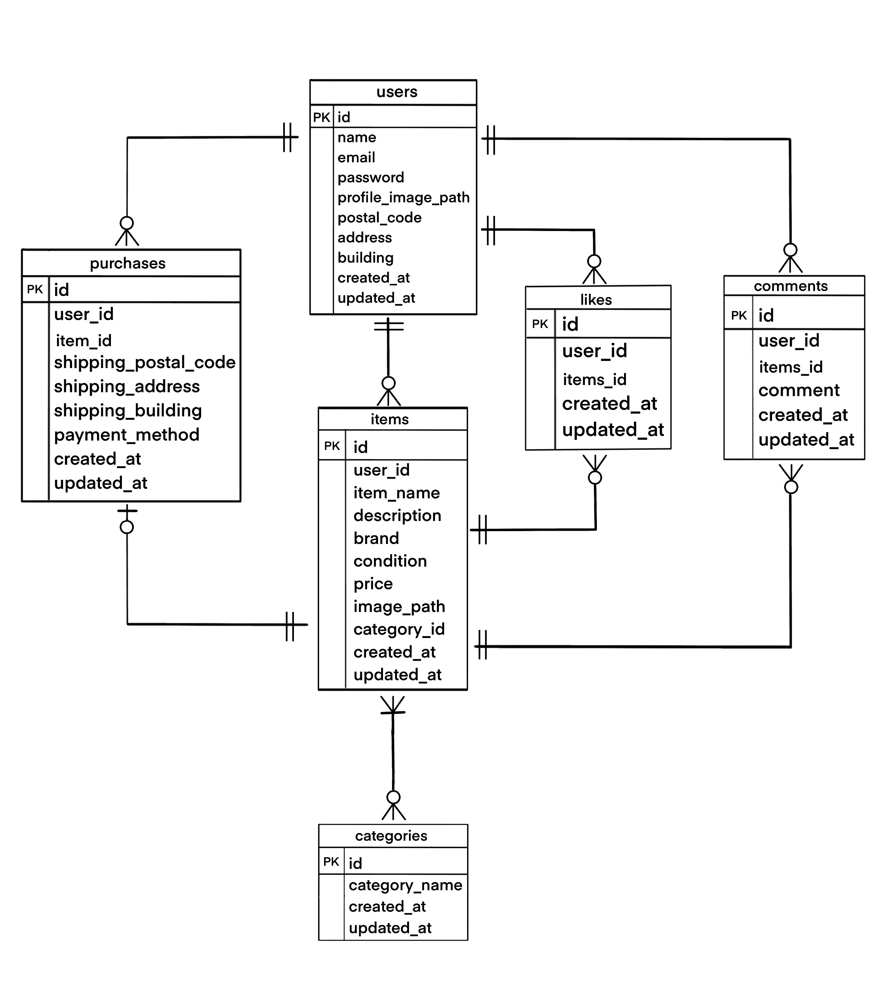

# フリマアプリ

## 環境構築

- Docker ビルド
  1.git clone git@github.com:POYO0328/FurimaApp.git
  2.docker-compose up -d -buld

\*MySQL は、OS によって起動しない場合があるのでそれぞれの PC に合わせて docker-compose.yml ファイルを編集してください。

Laravel 環境構築

1. docker-composer exec php bash
2. composer install
3. envexample ファイルから.env を作成し、環境変数を変更
4. php artisan key:generate
5. php artisan migrate
6. php artisan db:seed
7. composer require stripe/stripe-php
8. .env ファイル内に STRIPE_SECRET_KEY=（Stripeの管理画面から取得したキー）
   STRIPE_PUBLIC_KEY=（Stripeの管理画面から取得したキー）

## 使用技術

・PHP 8.4.3
・Laravel 8.83.8
・MySQL 8.0

## ER 図

## URL

・開発環境：http://localhost/
・phpMyAdmin：http://localhost:8080/
・Stripe：https://checkout.stripe.com/c/pay/cs_test...

## 仕様

1. マイページの出品一覧、購入一覧からは詳細ページは開かない仕様です
2. 検索機能を使って検索した後、再度おすすめ押下で検索ワードはリセットされる仕様です
3. Spriteは、試験内容で接続すると記載がありましたので接続のみ実装しております。※そのあとの動きは未実装です。

## テストユーザー/データ
1. 'name' => '山田 太郎',
   'email' => 'yamada@example.com'

2. 'name' => '佐藤 花子',
   'email' => 'sato@example.com'

3. 'name' => '鈴木 次郎',
   'email' => 'suzuki@example.com'

4. 'name' => '田中 美咲',
   'email' => 'tanaka@example.com'

5. 'name' => '高橋 健太',
   'email' => 'takahashi@example.com'

全員のパスワード：password
一人２つずつ出品しており、計１０個の商品が最初出品されています

## テストコード
1. 会員登録機能　
2. ログイン機能　
3. ログアウト　php artisan test --filter=LogoutTest
4. 商品一覧取得　
5. マイリスト一覧取得
6. 商品検索機能　php artisan test --filter=ProductSearchTest
7. 商品詳細情報取得　
8. いいね機能　php artisan test --filter=LikeFeatureTest
9. コメント送信機能　
10. 商品購入機能　
11. 支払方法　php artisan test --filter=PaymentMethodTest
12. 配送先変更機能　php artisan test --filter=ChangeShippingAddressTest
13. ユーザー情報所得　php artisan test --filter=UserProfileDataTest
14. ユーザー情報変更　php artisan test --filter=UserProfileEditTest
15. 出品商品情報登録　php artisan test --filter=ItemRegisterTest(ExhibitionRequestの画像バリデーション  'image' => ['required', 'file', 'mimes:jpeg,png'],を外して、テスト)※テストで実際の画像でないとエラーが出てしまうため

